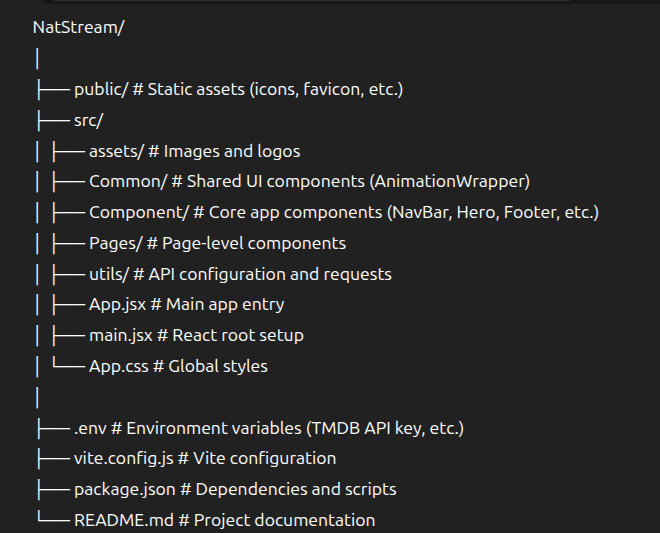

# 🎬 NatStream

**NatStream** is a modern movie streaming web app built with **React**, **Vite**, and **Tailwind CSS**.  
It fetches real-time movie data from the **TMDB API** and allows users to explore trending, top-rated, and genre-based movie categories.

The UI is inspired by Netflix, featuring smooth animations, video trailers, and a responsive layout.

---

## 🚀 Features

- 🎥 **Dynamic Movie Sections** — Displays movies by categories such as Originals, Trending, Top Rated, and more.
- 🔍 **Search Bar** — Allows users to search movies easily.
- 🎬 **Movie Trailers** — Play trailers directly in a modal via YouTube integration.
- 🧭 **Responsive Navigation Bar** — Includes a dropdown Genre menu and a mobile hamburger menu.
- 🌈 **Beautiful Hero Section** — Randomly displays a featured movie with typewriter-style animated description.
- ⚡ **Fast and Lightweight** — Powered by Vite and optimized with Tailwind CSS.
- 📱 **Fully Responsive** — Works seamlessly on desktop and mobile.
- 🔗 **Interactive Footer** — Includes social media links and company info.

---

## 🧩 Tech Stack

| Technology                 | Purpose                            |
| -------------------------- | ---------------------------------- |
| **React 19**               | Component-based UI                 |
| **Vite 7**                 | Fast development and build tool    |
| **Tailwind CSS 4**         | Utility-first styling              |
| **Axios**                  | API requests                       |
| **Framer Motion / Motion** | Smooth animations                  |
| **React Type Animation**   | Typewriter-style text              |
| **React YouTube**          | Embed and control YouTube trailers |
| **Movie-Trailer**          | Fetch YouTube trailer URLs         |
| **React Social Icons**     | Social media icons                 |
| **Dotenv**                 | Environment variable handling      |

---

## 📁 Project Structure



---

## ⚙️ Setup and Installation

### 1️⃣ Clone the Repository

```bash
git clone https://github.com/NatnaelAbWe/NatStream.git
cd NatStream
```

### 2️⃣ Install Dependencies

```bash
npm run dev
```

### 3️⃣ Add Environment Variables

```bash
VITE_TMDB_API_KEY=your_tmdb_api_key_here
```

- [You can get an API key from The Movie Database (TMDB)] [https://www.themoviedb.org/]

```bash
npm run dev
```

## 🧠 Key Components

### Hero.jsx

- Displays a randomly selected featured movie with its backdrop and description animated using react-type-animation.

### NavBar.jsx

- Responsive navigation bar with a Genre dropdown, a Search bar, and a Mobile menu toggle.

### MainSection.jsx

- Fetches movie data from TMDB API and displays posters. Clicking a movie opens its trailer via react-youtube.

### Footer.jsx

- Displays the app logo, social media icons, and company info with a gradient background.

## 🧪 API Integration

- All API requests are handled through /src/utils/axios.js and /src/utils/requests.js.

````bash
const instance = axios.create({
  baseURL: "https://api.themoviedb.org/3",
});

```JS
const instance = axios.create({
  baseURL: "https://api.themoviedb.org/3",
});
````
